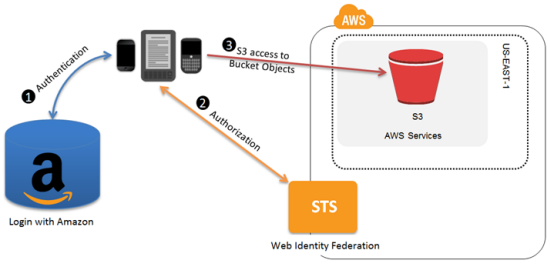
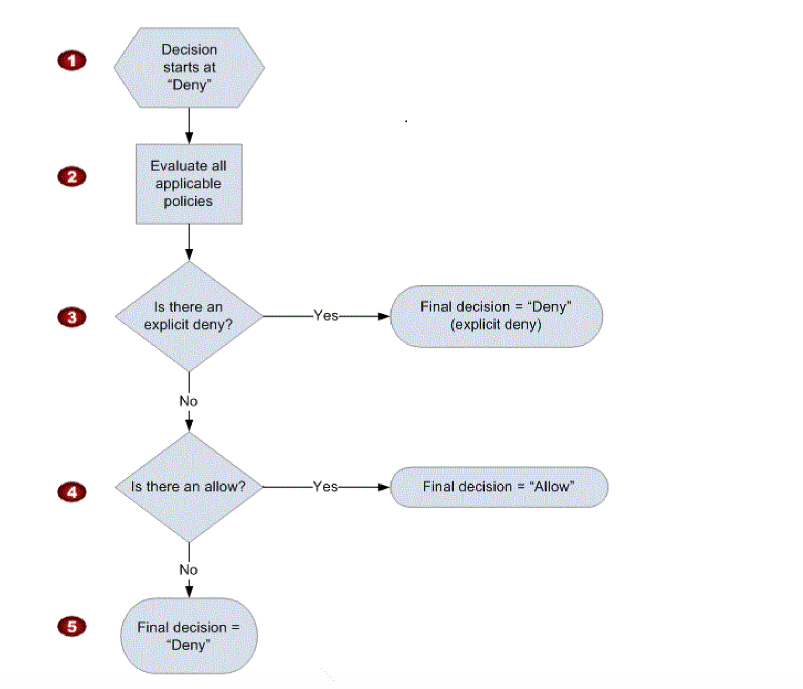

# AWS Identity and Access Management (IAM)

## Overview

1. Web service that helps you **securely control access** to AWS resources for your users
2. Used to control
    1. **Identity** – who can use your AWS resources (authentication)
    2. **Access** – what resources they can use and in what ways (authorisation)
3. Can also keep your account **credentials private**
4. With IAM, multiple IAM users can be created under the umbrella of the AWS account or temporary access can be enabled through identity federation with corporate directory or third party providers
5. IAM also enables access to resources across AWS accounts.

## Features

1. **Shared access to your AWS account** - Grant other people permission to administer and use resources in your AWS account without having to share your password or access key.
2. **Granular permissions** - Each user can be granted with different set granular permissions as required to perform their job
3. **Secure access to AWS resources for applications that run on EC2** - IAM can help provide applications running on EC2 instance temporary credentials that they need in order to access other AWS resources
4. **Identity federation** - IAM allows users to access AWS resources, without requiring the user to have accounts with AWS, by providing temporary credentials for e.g. through corporate network or Google or Amazon authentication
5. **Identity information for assurance** - CloudTrail can be used to receive log records that include information about those who made requests for resources in the account
6. **PCI DSS Compliance** - IAM supports the processing, storage, and transmission of credit card data by a merchant or service provider, and has been validated as being Payment Card Industry Data Security Standard (PCI DSS) compliant
7. **Integrated with many AWS services**
8. **Eventual consistency** - IAM, like many other AWS services, is eventually consistent and achieves high availability by replicating data across multiple servers within Amazon’s data centres around the world. Changes made to IAM would be eventually consistent and hence would take some time to reflect
9. **Free to use** - IAM is offered at no additional charge and charges are applied only for use of other AWS products by your IAM users
10. **AWS Security Token Service** - No additional charge. AWS charges only for the use of other AWS services accessed by the AWS STS temporary security credentials.

## Identities

IAM identities determine who can access and help to provide authentication for people and processes in your AWS account

### Account Root User

1. Root Account Credentials are the email address and password with which you sign-in into the AWS account
2. Root Credentials has full unrestricted access to AWS account including the account security credentials which include sensitive information
3. ***IAM Best Practice*** – Do not use or share the Root account once the AWS account is created, instead create a separate user with admin privilege
4. An Administrator account can be created for all the activities which too has full access to the AWS account except the accounts security credentials, billing information and ability to change password

### IAM Users

1. IAM user represents the person or service who uses the access to interact with AWS.
2. ***IAM Best Practice*** – Create Individual Users
3. User credentials can consist of the following
    1. Password to access AWS services through AWS Management Console
    2. Access Key/Secret Access Key to access AWS services through API, CLI or SDK
4. IAM user starts with no permissions and is not authorised to perform any AWS actions on any AWS resources and should be granted permissions as per the job function requirement
5. ***IAM Best Practice*** – Grant least Privilege
6. Each IAM user is associated with one and only one AWS account.
7. IAM User cannot be renamed from AWS management console and has to be done from CLI or SDK tools.
8. IAM handles the renaming of user w.r.t unique id, groups, policies where the user was mentioned as a principal. However, you need to handle the renaming in the policies where the user was mentioned as a resource

### IAM Groups

1. IAM group is a collection of IAM users
2. IAM groups can be used to specify permissions for a collection of users sharing the same job function making it easier to manage
3. ***IAM Best Practice*** – Use groups to assign permissions to IAM Users
4. A group is not truly an identity because it cannot be identified as a Principal in an access policy. It is only a way to attach policies to multiple users at one time
5. A group can have multiple users, while a user can belong to multiple groups (10 max)
6. Groups cannot be nested and can only have users within it
7. AWS does not provide any default group to hold all users in it and if one is required it should be created with all users assigned to it.
8. Renaming of a group name or path, IAM handles the renaming w.r.t to policies attached to the group, unique ids, users within the group. However, IAM does not update the policies where the group is mentioned as a resource and must be handled manually
9. Deletion of the groups requires you to detach users and managed policies and delete any inline policies before deleting the group. With AWS management console, the deletion and detachment is taken care of.

## IAM Roles

### Identity Providers and Federation

1. Identity Provider can be used to grant external user identities permissions to AWS resources without having to be created within your AWS account.
2. External user identities can be authenticated either through the organization’s authentication system or through a well-know identity provider such as login with Amazon, Google etc (Oauth).
3. IAM supports IdPs that are compatible with OpenID Connect (OIDC) or SAML 2.0 (Security Assertion Markup Language 2.0)

### Web Identity Federation

[https://web-identity-federation-playground.s3.amazonaws.com/index.html](https://web-identity-federation-playground.s3.amazonaws.com/index.html)

### Mobile or Web Identity Federation with Cognito

### SAML 2.0-based Federation

## IAM Access Management

1. IAM Access Management is all about Permissions and Policies. Defined in JSON format.
2. Permission allows you to define who has access and what actions can they perform.
3. IAM Policy is a document that formally states one or more permissions. Helps to fine tune the permissions granted to the policy owner. 
4. Most restrictive Policy always wins.
5. IAM policy basically states “**Principal A is allowed or denied (effect) to perform Action B on Resource C given Conditions D are satisfied**”.

### Identity-Based vs Resource-Based Permissions

**Identity-based, or IAM permissions**

1. Attached to an IAM user, group, or role and specify what the user, group or role can do
2. User, group, or role itself acts as a Principal
3. Can either be inline or managed

**Resource-based permissions**

1. Permissions are attached to a resource for e.g. S3, SNS
2. Specifies both who has access to the resource (Principal) and what actions they can perform on it (Actions)
3. Inline only, not managed.
4. Supported only by some AWS services

### Managed Policies and Inline Policies

**Managed policies**

1. Standalone policies that can be attached to multiple users, groups, and roles in an AWS account.
2. Applies only to identities (users, groups, and roles) but not for resources.
3. Allow reusability
4. Implemented as versions
5. Have their own ARN
6. Two types of managed policies:
    1. AWS managed policies - Created and managed by AWS. Cannot be modified.
    2. Customer managed policies - Standalone and custom policies created and administered by customer. Allows more precise control.

**Inline Policies**

1. Created and managed by customer, and are embedded directly into a single user, group, or role.
2. Deletion of the Entity (User, Group or Role) or Resource deletes the In-Line policy as well

### IAM Policy Simulator

Helps test and troubleshoot IAM and resource-based policies

### IAM Policy Evaluation

### AWS IAM Roles vs Resource Based Policies

AWS allows granting cross-account access to AWS resources, which can be done using IAM Roles or Resource Based policies

**IAM Roles**

1. Roles can be created to act as a proxy to allow users or services to access resources
2. Roles supports trust policy which helps determine who can access the resources and permission policy which helps to determine what they can access
3. User who assumes a role temporarily gives up his or her own permissions and instead takes on the permissions of the role. When the user exits, or stops using the role, the original user permissions are restored.
4. Can be used to provision access to almost all the AWS resources

**Resource based Policies**

1. Resource based policy allows you to attach a policy directly to the resource that you want to share, instead of using a role as a proxy.
2. Resource-based policy specifies who, as a Principal in the form of a list of AWS account ID numbers, can access that resource and what they can access
3. With Cross-account access with a resource-based policy, User still works in the trusted account and does not have to give up her user permissions in place of the role permissions.
4. User can work on the resources from both the accounts at the same time and this can be useful for scenarios for e.g. copying of objects from one bucket to the other

### AWS IAM Best Practices

1. Root Account -Don’t use & Lock away access keys
2. User – Create individual IAM users
3. Groups – Use groups to assign permissions to IAM users
4. Permission – Grant least privilege
5. Passwords – Enforce strong password policy for users
6. MFA – Enable MFA for privileged users
7. Role – Use roles for applications that run on EC2 instances instead of creating IAM user and hardcoding the credentials within that application.
8. Sharing – Delegate using roles
9. Rotation – Rotate credentials regularly
10. Track – Remove unnecessary credentials
11. Conditions – Use policy conditions for extra security
12. Auditing – Monitor activity in the AWS account