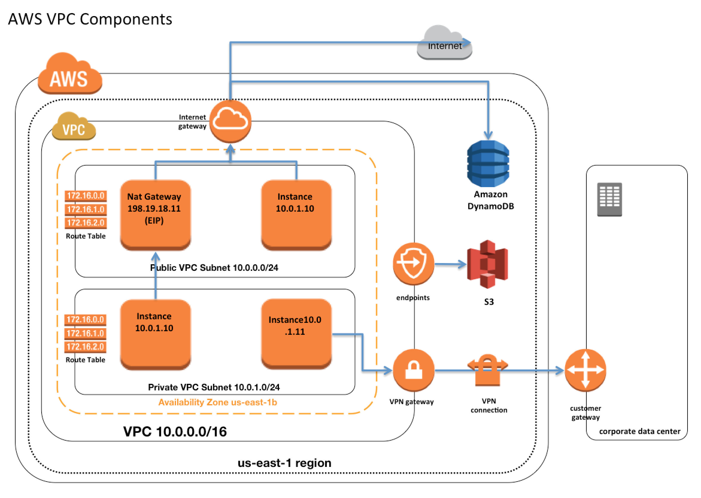

# AWS VPC

[https://www.youtube.com/watch?v=fpxDGU2KdkA](https://www.youtube.com/watch?v=fpxDGU2KdkA) - Seems like a pretty good resource

## VPC Overview & Components

1. Virtual network dedicated to the AWS account. It is logically isolated from other virtual networks in the AWS cloud.
2. Allows
    1. select IP address range
    2. create subnets
    3. configure route tables, network gateways, and security settings
3. VPC allows VPC Peering connections with other VPC within the same or different AWS accounts
4. A VPC peering connection is a networking connection between two VPCs that enables routing of traffic between them using private IP addresses.
5. Connection between your VPC and corporate or home network can be established, however the CIDR blocks should be not be overlapping for e.g. VPC with CIDR 10.0.0.0/16 can communicate with 10.1.0.0/16 corporate network but the connections would be dropped if it tries to connect to 10.0.37.0/16 corporate network cause of overlapping ip addresses.
6. Deletion of the VPC is possible only after terminating all instances within the VPC, and deleting all the components with the VPC for e.g. subnets, security groups, network ACLs, route tables, Internet gateways, VPC peering connections, and DHCP options

### VPC Sizing

1. VPC needs a set of IP addresses in the form of a Classless Inter-Domain Routing (CIDR) block for e.g, 10.0.0.0/16, which allows 2^16 (65536) IP address to be available
2. Allowed CIDR block size is between
    1. /28 netmask (minimum with 2^4 – 16 available IP address)
    2. /16 netmask (maximum with 2^16 – 65536 IP address)
3. CIDR block from private (non-publicly routable) IP address can be assigned
    1. 10.0.0.0 – 10.255.255.255 (10/8 prefix)
    2. 172.16.0.0 – 172.31.255.255 (172.16/12 prefix)
    3. 192.168.0.0 – 192.168.255.255 (192.168/16 prefix)
4. VPC can be resized
5. Each VPC is separate from any other VPC created with the same CIDR block even if it resides within the same AWS account

### AWS VPC Components

## IP Addresses

Instances launched in the VPC can have Private, Public and Elastic IP address assigned to it and are properties of ENI (Network Interfaces)

### Private IP Addresses

1. Private IP addresses are not reachable over the Internet, and can be used for communication only between the instances within the VPC
2. All instances are assigned a private IP address, within the IP address range of the subnet
3. Primary IP address is associated with the network interface for its lifetime, even when the instance is stopped and restarted and is released only when the instance is terminated
4. Additional Private IP addresses, known as secondary private IP address, can be assigned to the instances and these can be reassigned from one network interface to another

### Public IP Addresses

1. Reachable over the Internet. Can be used for communication between instances and the Internet, or with other AWS services that have public endpoints
2. Assignment depends if the Public IP Addressing is enabled for the Subnet.
3. Public IP address can also be assigned to the Instance by enabling the Public IP addressing during the creation of the instance, which overrides the subnet’s public IP addressing attribute
4. Public IP address is assigned from AWS pool of IP addresses and it is not associated with the AWS account and hence is released when the instance is stopped and restarted or terminated.

### Elastic IP address

1. Elastic IP addresses are static, persistent public IP addresses which can be associated and disassociated with the instance, as required
2. Elastic IP address is allocated at an VPC and owned by the account unless released
3. A Network Interface can be assigned either a Public IP or an Elastic IP. If you assign an Elastic IP to an instance already having a Public IP, the public IP is released
4. Can be moved from one instance to another
5. Charged for non usage

## Elastic Network Interface (ENI)

1. Each Instance is attached with default elastic network interface (Primary Network Interface eth0) and cannot be detached from the instance
2. ENI can include the following attributes
    1. Primary private IP address
    2. One or more secondary private IP addresses
    3. One Elastic IP address per private IP address
    4. One public IP address
    5. One or more security groups
    6. A MAC address
    7. A source/destination check flag
    8. A description
3. ENI’s attributes follow the ENI as it is attached or detached from an instance and reattached to another instance. When an ENI is moved from one instance to another, network traffic is redirected to the new instance.
4. Multiple ENIs can be attached to an instance. Can be used to create a low-budget, high-availability solution.

## Route Tables

1. Route table defines rules, termed as routes, which determine where network traffic from the subnet would be routed
2. Each VPC has a implicit router to route network traffic
3. Each VPC has a Main Route table, and can have multiple custom route tables created
4. Subnet within a VPC must have a single route table while a route table can have multiple subnets
5. Subnet, if not explicitly associated to a route table, is implicitly associated with the main route table
6. Every route table contains a local route that enables communication within a VPC which cannot be modified or deleted
7. Route priority is decided by matching the most specific route in the route table that matches the traffic
8. Route tables needs to be updated to defined routes for Internet gateways, Virtual Private gateways, VPC Peering, VPC Endpoints, NAT Device etc.

## Internet Gateways – IGW

1. An Internet gateway is a horizontally scaled, redundant, and highly available VPC component that allows communication between instances in the VPC and the Internet.
2. IGW imposes no availability risks or bandwidth constraints on the network traffic.
3. Serves two purposes:
    1. To provide a target in the VPC route tables for Internet-routable traffic
    2. To perform network address translation (NAT) for instances that have been NOT been assigned public IP addresses.
4. **Enabling Internet access to an Instance requires**
    1. Attaching Internet gateway to the VPC
    2. Subnet should have route tables associated with the route pointing to the Internet gateway
    3. Instances should have a Public IP or Elastic IP address assigned
    4. Security groups and NACLs associated with the Instance should allow relevant traffic

## NAT

1. NAT device enables instances in a private subnet to connect to the Internet or other AWS services, but prevents the Internet from initiating connections with the instances.
2. Does not support IPv6 traffic. Use egress-only Internet gateway instead.
3. Use with IPv4 traffic only

## Egress-only Internet gateway

1. Works as a NAT gateway, but for IPv6 traffic
2. Horizontally scaled, redundant, and highly available VPC component that allows outbound communication over IPv6 from instances in the VPC to the Internet, and prevents the Internet from initiating an IPv6 connection with the instances.
3. Use with IPv6 traffic only

## VPC & Subnet Sizing

1. VPC supports IPv4 and IPv6 (optional) addressing, and has different CIDR block size limits for each
2. Limitations
    1. allowed block size is between a /28 netmask and /16 netmask.
    2. CIDR block must not overlap with any existing CIDR block that’s associated with the VPC.
    3. CIDR block must not be the same or larger than the CIDR range of a route in any of the VPC route tables for e.g. for a CIDR block 10.0.0.0/24, can only associate smaller CIDR blocks like 10.0.0.0/25
3. Refer RFC 1918 and [https://www.ipaddressguide.com/cidr](https://www.ipaddressguide.com/cidr)

## VPC Security

1. Security groups – Act as a firewall for associated EC2 instances, controlling both inbound and outbound traffic at the instance level
2. Network access control lists (ACLs) – Act as a firewall for associated subnets, controlling both inbound and outbound traffic at the subnet level
3. Flow logs – Capture information about the IP traffic going to and from network interfaces in your VPC. Stored using Amazon CloudWatch Logs. Do not capture real-time log streams for network interfaces. Can be created for network interfaces that are created by other AWS services

## Subnets

1. Spans a single Availability Zone
2. Can be configured with an Internet gateway to enable communication over the Internet, or virtual private gateway (VPN)
3. Can be Public or Private
4. Instances within the Public Subnet should be assigned a Public IP or Elastic IP address to be able to communicate with the Internet
5. For Subnets not connected to the Internet, but has traffic routed through Virtual Private Gateway only is termed as VPN-only subnet

### Subnet Sizing

1. CIDR block assigned to the Subnet can be the same as the VPC CIDR, in this case you can launch only one subnet within your VPC
2. CIDR block assigned to the Subnet can be a subset of the VPC CIDR, which allows you to launch multiple subnets within the VPC
3. CIDR block assigned to the subnet should not be overlapping with other subnets
4. AWS reserves 5 IPs address (first 4 and last 1 IP address) in each Subnet which are not available for use and cannot be assigned to an instance. for e.g. for a Subnet with a CIDR block 10.0.0.0/24 the following five IPs are reserved
    1. 10.0.0.0: Network address
    2. 10.0.0.1: Reserved by AWS for the VPC router
    3. 10.0.0.2: Reserved by AWS for mapping to Amazon-provided DNS
    4. 10.0.0.3: Reserved by AWS for future use
    5. 10.0.0.255: Network broadcast address. AWS does not support broadcast in a VPC, therefore the address is reserved.

### Subnet Routing

Each Subnet is associated with a route table which controls the traffic.

### Subnet Security

1. Subnet security can be configured using Security groups and NACLs
2. Security groups works at instance level, NACLs work at the subnet level

## Shared VPCs

1. VPC sharing allows multiple AWS accounts to create their application resources, such as EC2 instances, RDS databases, Redshift clusters, and AWS Lambda functions, into shared, centrally-managed VPCs.
2. In this model, the account that owns the VPC (owner) shares one or more subnets with other accounts (participants) that belong to the same organization from AWS Organizations.
3. After a subnet is shared, the participants can view, create, modify, and delete their application resources in the subnets shared with them. Participants cannot view, modify, or delete resources that belong to other participants or the VPC owner.